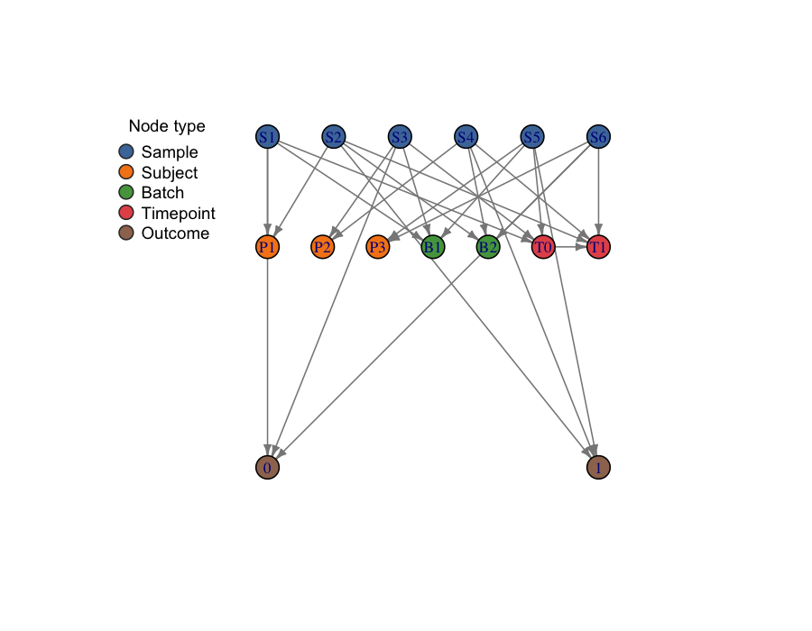

# splitGraph: Dataset Dependency Graphs for Leakage-Aware Evaluation

`splitGraph` is an R package for representing biomedical dataset structure as a
typed dependency graph so that leakage-relevant relationships can be made
explicit, validated, queried, and converted into deterministic split
constraints.

It does not fit models, run preprocessing pipelines, or generate resamples by
itself. Its job is to encode dataset structure *before* evaluation so that
overlap, provenance, and time-ordering assumptions are inspectable instead of
implicit.



The plot above shows six samples (blue) that share three subjects (orange),
two batches (green), two timepoints (red), and two outcome classes (brown).
A plain `vfold_cv` on this dataset would violate subject, batch, *and* time
structure at the same time — and that is exactly what the graph is designed
to make visible.

## Why It Exists

In biomedical evaluation workflows, leakage often comes from dataset structure
rather than obvious coding mistakes. Samples may share:

- the same subject
- the same batch
- the same study
- the same collection timepoint
- the same assay provenance
- the same derived feature set
- the same outcome definition

If those relationships are not modeled explicitly, a train/test split can look
correct while still violating the intended scientific separation.

`splitGraph` makes those dependencies first-class objects.

## What It Does (and Does Not Do)

**Does:**

- metadata ingestion with canonical ID normalization
- one-shot graph construction from canonical metadata via
  `graph_from_metadata()`
- typed node and edge constructors backed by `igraph`
- structural, semantic, and leakage-relevant validation, with a documented
  `validation_overrides` mechanism for explicit exceptions
- typed query and traversal helpers (with a safety cap on `query_paths()`)
- projected sample-dependency detection
- split-constraint derivation for subject, batch, study, time, and composite
  modes
- translation of constraints into a stable, tool-agnostic `split_spec`
- split-spec preflight validation and leakage summary helpers
- JSON serialization for `dependency_graph` and `split_spec` so handoff
  objects are portable across sessions and languages (`write_*()` /
  `read_*()`, requires `jsonlite`)
- typed layered `plot()` method with per-type colors and a node-type legend
- `print()`, `summary()`, and `as.data.frame()` on all core S3 objects

**Does not:**

- fit models or run preprocessing pipelines
- generate resamples (`rsample` does that)
- implement leakage-aware *training* workflows
- provide a general-purpose graph analytics toolkit

The package is intentionally narrow: dataset dependency structure for
leakage-aware evaluation design.

## Installation

From GitHub:

```r
install.packages("remotes")
remotes::install_github("selcukorkmaz/splitGraph")
```

To use the JSON serialization API, also install `jsonlite`:

```r
install.packages("jsonlite")
```

## Quick Start

The fastest path is `graph_from_metadata()`, which auto-detects canonical
columns in a metadata frame and assembles a validated `dependency_graph`:

```r
library(splitGraph)

meta <- data.frame(
  sample_id    = c("S1", "S2", "S3", "S4", "S5", "S6"),
  subject_id   = c("P1", "P1", "P2", "P2", "P3", "P3"),
  batch_id     = c("B1", "B2", "B1", "B2", "B1", "B2"),
  timepoint_id = c("T0", "T1", "T0", "T1", "T0", "T1"),
  time_index   = c(0, 1, 0, 1, 0, 1),
  outcome_id   = c("ctrl", "case", "ctrl", "case", "case", "ctrl")
)

g <- graph_from_metadata(meta, graph_name = "demo")
plot(g)

validation <- validate_graph(g)
subject_constraint <- derive_split_constraints(g, mode = "subject")
spec <- as_split_spec(subject_constraint, graph = g)
validate_split_spec(spec)
summarize_leakage_risks(g, constraint = subject_constraint, split_spec = spec)

# Persist the spec for a downstream consumer (R or non-R):
path <- tempfile(fileext = ".json")
write_split_spec(spec, path)
spec2 <- read_split_spec(path)
```

For full control over node labels, attribute columns, and the feature-set
provenance edges, use `create_nodes()` / `create_edges()` /
`build_dependency_graph()` directly. `graph_from_metadata()` auto-builds
the six sample-rooted canonical edges, `timepoint_precedes`, and the
appropriate outcome edge (`sample_has_outcome` by default, or
`subject_has_outcome` when `outcome_scope = "subject"`). The
`featureset_generated_from_study` and `featureset_generated_from_batch`
edges always require the explicit constructor path.

## Downstream Handoff

`split_spec` is the tool-agnostic handoff object produced by
`as_split_spec()`. `splitGraph` does not know about any particular
resampling package — downstream consumers are expected to provide their own
adapters so that `splitGraph` stays neutral and has no runtime dependency
on them.

The typical end-to-end flow is:

1. `graph_from_metadata(meta)` → typed `dependency_graph`
2. `derive_split_constraints(g, mode = ...)` → `split_constraint`
3. `as_split_spec(constraint, graph = g)` → `split_spec`
4. (optional) `write_split_spec(spec, path)` → JSON, for cross-session or
   cross-language handoff
5. adapter in the downstream package → native resamples

The `sample_data` frame carried by `split_spec` exposes exactly what an
adapter needs: `sample_id` for joining against the observation frame,
`group_id` for grouped resampling, `batch_group` / `study_group` for
blocking, and `order_rank` for ordered evaluation. An adapter can be built
on top of, for example, `rsample::group_vfold_cv()` (grouped CV keyed to
`group_id`) or `rsample::rolling_origin()` (ordered evaluation keyed to
`order_rank`).

For three small, self-contained adapter examples (a base-R LOGO adapter,
plus illustrative `rsample::group_vfold_cv()` and `rsample::rolling_origin()`
adapters), see the **Adapter cookbook** vignette:

```r
vignette("adapter-cookbook", package = "splitGraph")
```

## Core Concepts

### Node types

- `Sample`, `Subject`, `Batch`, `Study`, `Timepoint`, `Assay`, `FeatureSet`,
  `Outcome`

### Canonical edge types

- `sample_belongs_to_subject`
- `sample_processed_in_batch`
- `sample_from_study`
- `sample_collected_at_timepoint`
- `sample_measured_by_assay`
- `sample_uses_featureset`
- `sample_has_outcome`
- `subject_has_outcome`
- `timepoint_precedes`
- `featureset_generated_from_study`
- `featureset_generated_from_batch`

### Main S3 objects

`graph_node_set`, `graph_edge_set`, `dependency_graph`,
`depgraph_validation_report`, `graph_query_result`, `split_constraint`,
`split_spec`, `split_spec_validation`, `leakage_risk_summary`.

## Main Functions

| Layer | Functions |
|---|---|
| Ingestion and construction | `ingest_metadata()`, `graph_from_metadata()`, `create_nodes()`, `create_edges()`, `build_dependency_graph()`, `dependency_graph()`, `as_igraph()` |
| Validation | `validate_graph()` (with `validation_overrides`), `validate_split_spec()` |
| Queries | `query_node_type()`, `query_edge_type()`, `query_neighbors()`, `query_paths()` (capped by default), `query_shortest_paths()`, `detect_dependency_components()`, `detect_shared_dependencies()` |
| Constraint derivation | `derive_split_constraints()`, `grouping_vector()` |
| Split-spec translation | `as_split_spec()`, `summarize_leakage_risks()` |
| Serialization (JSON) | `write_dependency_graph()`, `read_dependency_graph()`, `write_split_spec()`, `read_split_spec()` |

## Example Queries

```r
query_node_type(g, "Subject")
query_edge_type(g, "sample_processed_in_batch")
query_neighbors(g, node_ids = "sample:S1", edge_types = "sample_belongs_to_subject")
detect_shared_dependencies(g, via = "Batch")
detect_dependency_components(g, via = c("Subject", "Batch"))
```

## Example Split Designs

```r
subject_constraint <- derive_split_constraints(g, mode = "subject")
batch_constraint   <- derive_split_constraints(g, mode = "batch")
study_constraint   <- derive_split_constraints(g, mode = "study")
time_constraint    <- derive_split_constraints(g, mode = "time")

strict_composite <- derive_split_constraints(
  g, mode = "composite", strategy = "strict",
  via = c("Subject", "Batch")
)

rule_based_composite <- derive_split_constraints(
  g, mode = "composite", strategy = "rule_based",
  priority = c("batch", "study", "subject", "time")
)
```

## Serialization (JSON)

Both core handoff objects can be written to a stable, schema-versioned
JSON format and read back, so a `dependency_graph` or `split_spec` is
portable across R sessions and across language boundaries.

```r
graph_path <- tempfile(fileext = ".json")
spec_path  <- tempfile(fileext = ".json")

write_dependency_graph(g, graph_path)
write_split_spec(spec, spec_path)

g2    <- read_dependency_graph(graph_path)
spec2 <- read_split_spec(spec_path)
```

The JSON schema is documented under `?write_dependency_graph` and
`?write_split_spec`. Each file carries a `schema_version` field; reading a
file written under a different schema version emits a warning but still
loads. `NA` values in `sample_data` round-trip as JSON `null`. The
`jsonlite` package (a `Suggests` dep) must be installed.

## Plot Method

`plot(g)` renders a typed, layered layout with per-type node colors and an
auto-generated node-type legend. Layers: Sample (top), peer dependencies
(Subject / Batch / Study / Timepoint) in the middle band,
Assay / FeatureSet next, Outcome (bottom).

```r
plot(g)                              # typed layered layout (default)
plot(g, layout = "sugiyama")         # alternative hierarchical layout
plot(g, show_labels = FALSE)         # hide node labels on dense graphs
plot(g, legend = FALSE)              # suppress the legend
plot(g, legend_position = "bottomright")
plot(g, node_colors = c(Sample = "#000000"))  # override type colors
```

## Citation

```r
citation("splitGraph")
```

produces:

> Korkmaz S (2026). *splitGraph: Dataset Dependency Graphs for
> Leakage-Aware Evaluation*. R package version 0.2.0.
> <https://github.com/selcukorkmaz/splitGraph>

## License

MIT. See `LICENSE`.

## Appendix: Design Guarantees

The package prefers explicit failure over silent guessing. In particular:

- unknown sample IDs, ambiguous direct assignments, and conflicting
  duplicate nodes or edges are rejected rather than silently resolved
- contradictory time-order metadata are rejected rather than reconciled
  arbitrarily
- validation truth is not changed by severity filters, and generated
  split specs are re-validated against the package's own preflight rules
- documented exceptions go through `validation_overrides` (e.g.
  `allow_multi_subject_samples`); the same override is honored by both
  `validate_graph()` and `derive_split_constraints(mode = "subject")`
- `query_paths()` defaults to a finite path-length cap so traversal cannot
  explode on dense graphs; pass `max_length = Inf` to opt out
- the on-disk JSON format is schema-versioned, and loading a file with a
  different `schema_version` warns rather than failing silently
